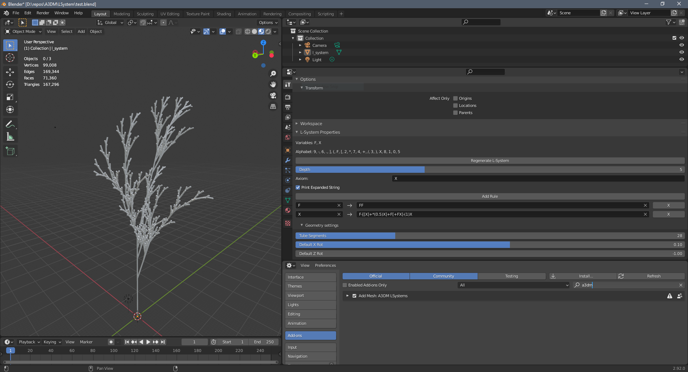

Implements an addon for blender that creates L-systems.
-----------------------------------

-----------------------------------
The addon requires at least Blender 2.8 but 2.92 is reccommended since it has been tested with this version.
Install the addon from Blender's Preferences editor by selecting the "Add-ons" tab on the left in the Preferences 
editor and selecting "Install..." on the top right. Install the zip-file with the addon.

To create an L-system navigate to the "Add" menu in the 3D-Viewport editor and select "Mesh"->"L-System".
A new object is created in the scene but it has no geometry yet. The generation of the geometry has to bet triggered
from the L-system settings.
The settings for the L-system object type are available from the properties editor under the 
"Active Tool and Workspace settings" tab. The object needs to be selected to view the settings.

Error messages and respective hints are printed to the system console. Also, if the option to print the expanded string 
is selected, then it is recommended to toggle the system console on.
